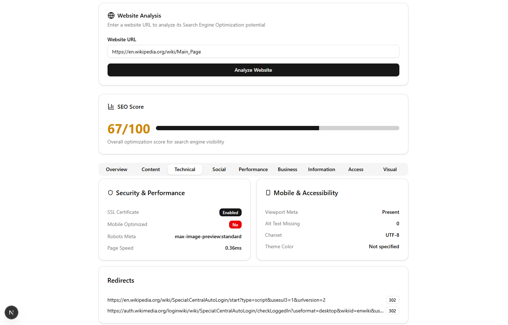
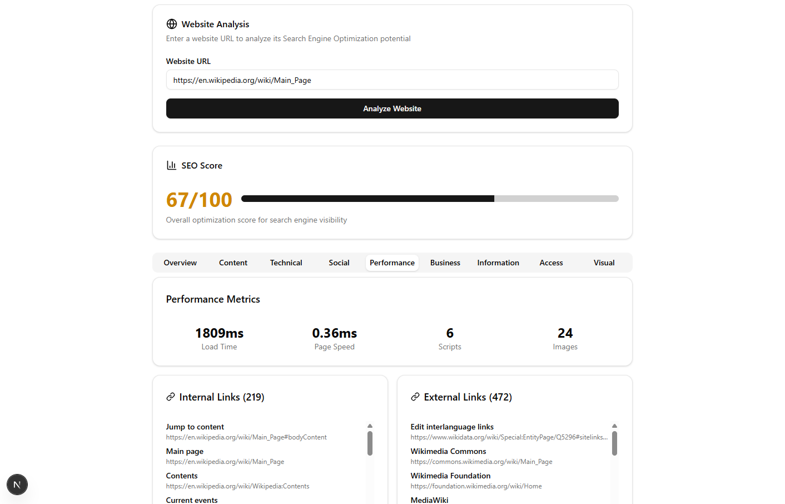

# 🕵️‍♂️ SEO Optimizer

SEO Optimizer is a modern web application built with **Next.js** and **Puppeteer** that allows users to analyze any public website’s SEO health, content structure, technical attributes, performance, business info, social presence, and more. It provides a detailed breakdown in a clean, tabbed interface — including visual previews and metadata analysis.





---

## 🚀 Features

- 🌐 Analyze any URL for SEO readiness
- 📊 SEO Score Overview
- 📄 Meta Tags, Keywords, OpenGraph & Twitter Cards
- 🏗️ Content hierarchy (H1–H6), word counts, readability metrics
- 🛠️ Technical insights (language, charset, SSL, redirects, etc.)
- 💻 Technology stack detection (React, Vue, GA, etc.)
- 📱 Mobile optimization check
- 📷 Full-page screenshot capture
- 🔍 Social links, contact info, business structured data
- ⚡ Performance metrics via Puppeteer
- 📁 Tabbed layout for easy exploration

---

## 📸 Screenshots

| SEO Overview | Performance Tab | Screenshot View |
|--------------|------------------|------------------|
|  |  |  |

---

## 🧑‍💻 Tech Stack

- **Frontend:** React (with Next.js App Router)
- **UI Components:** ShadCN + Radix UI
- **Form Handling:** `react-hook-form` + Zod validation
- **Web Scraping:** Puppeteer (Headless Chrome)
- **Type System:** TypeScript
- **SEO Evaluation Logic:** Custom DOM evaluation inside browser context

---

## 📦 Installation

1. **Clone the repository:**
   ```bash
   git clone https://github.com/diyarbakir-yazilim/seo-analysis.git
   cd seo-analysis
